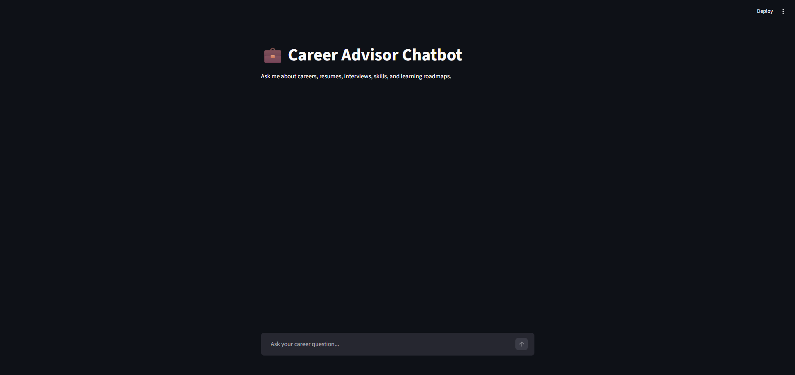
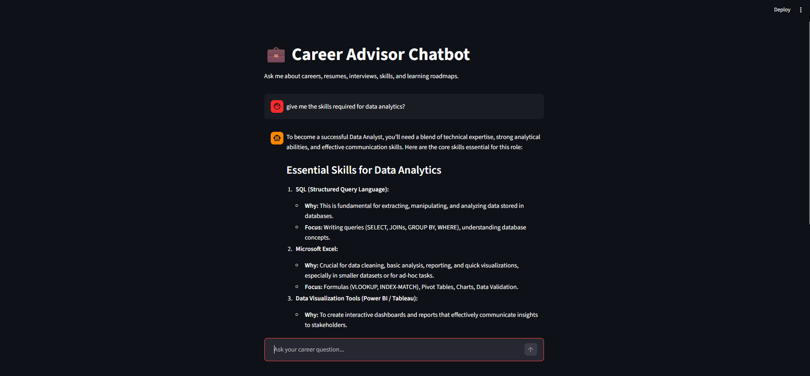

# 💼 Career Advisor Chatbot


An AI-powered Career Advisor Chatbot built using **Google Gemini GenAI API** and **Streamlit**.

This chatbot helps students, freshers, and early-career professionals with:

* Career Guidance
* Resume Improvement
* Interview Preparation
* Skill Roadmaps
* Learning Suggestions
* Job Role Recommendations

---

# 🌐 Live Demo

🔗 Live App:
https://career-advisor-chatbot-anji-embadi.streamlit.app/

🔗 GitHub Repository:
https://github.com/Anjiembadi/Career-Advisor-Chatbot

---

# 📌 Project Overview

The main goal of this project is to build a **production-style multi-turn conversational chatbot** for career guidance using **Generative AI**.

Instead of creating a basic chatbot demo, this project follows a modular AI engineering architecture where:

* API logic
* prompts
* configuration
* logging
* UI

are separated into different files for scalability and maintainability.

---

# 🎯 Domain Selected

## Career Advisor Chatbot

The chatbot provides guidance related to:

* Career planning
* Resume building
* Interview preparation
* AI/ML/Data Analyst roadmaps
* Skill recommendations
* Fresher job preparation
* Learning paths

---

# 🚀 Features

* Gemini API integration
* Secure API key management using `.env`
* Streamlit chat-style UI
* Multi-turn conversation support
* Conversation history handling
* Context window trimming
* Streaming AI responses
* Prompt engineering using reusable prompts
* Exception handling and fallback responses
* Logging system
* Modular production-style architecture

---

# 🛠️ Tech Stack

* Python
* Streamlit
* Google Gemini API
* python-dotenv
* Logging Module
* Git & GitHub

---

# 🏗️ Project Architecture

```text
User
   ↓
Streamlit UI (app.py)
   ↓
Gemini Client (gemini_client.py)
   ↓
Prompt Builder (prompts.py)
   ↓
Google Gemini API
   ↓
AI Response
   ↓
Streamlit Chat Interface
```

---

# 📂 Project Structure

```text
career_chatbot/
│
├── app.py
├── config.py
├── gemini_client.py
├── prompts.py
├── logger.py
├── requirements.txt
├── runtime.txt
├── .gitignore
├── README.md
└── images/
    ├── input.png
    └── output.png
```

---

# 🧠 What We Actually Did Step-by-Step

---

## Step 1: Created the Project Folder

We created a project folder named:

```text
career_chatbot
```

This folder contains all chatbot-related files.

---

## Step 2: Created a Virtual Environment

We created a virtual environment to manage project dependencies separately.

```bash
python -m venv venv
```

Activated it using:

```bash
venv\Scripts\activate
```

---

## Step 3: Installed Required Libraries

We installed the required Python libraries:

```bash
pip install streamlit google-generativeai python-dotenv
```

Libraries used:

* `streamlit` → chatbot UI
* `google-generativeai` → Gemini API integration
* `python-dotenv` → secure environment variable handling

---

## Step 4: Created `.env` File

We securely stored API credentials inside `.env`.

```text
GEMINI_API_KEY=your_api_key_here
GEMINI_MODEL=gemini-2.0-flash
```

This prevents exposing secret keys inside the codebase.

---

## Step 5: Created `config.py`

The `config.py` file loads environment variables from `.env`.

Responsibilities:

* Load Gemini API key
* Load Gemini model dynamically
* Centralize configuration settings

---

## Step 6: Created `prompts.py`

The `prompts.py` file stores reusable system prompts.

This prompt instructs the chatbot to:

* behave like a professional career advisor
* provide concise responses
* focus on freshers/students
* generate structured career guidance

---

## Step 7: Created `gemini_client.py`

The `gemini_client.py` file handles all Gemini API communication.

Responsibilities:

* Send prompts to Gemini
* Receive AI-generated responses
* Handle exceptions
* Stream AI responses in real time
* Trim old conversation history for context optimization

---

## Step 8: Created `logger.py`

The `logger.py` file handles application logging.

It records:

* user questions
* chatbot responses
* errors and exceptions

This helps in debugging and monitoring.

---

## Step 9: Created `app.py`

The `app.py` file is the main Streamlit application.

It manages:

* Streamlit UI
* Chat interface
* User input
* Assistant responses
* Conversation history
* Loading spinner
* Real-time response rendering

---

## Step 10: Added Multi-turn Conversation

We used:

```python
st.session_state.messages
```

to maintain conversation history.

This allows the chatbot to remember previous messages during the session.

---

## Step 11: Added Context Window Trimming

To prevent sending excessively large chat history to Gemini API:

* older messages are trimmed
* only recent conversation history is sent

This improves:

* performance
* token efficiency
* response speed

---

## Step 12: Added Streaming Responses

We enabled:

```python
stream=True
```

inside `generate_content()`.

This allows:

* real-time AI response rendering
* better user experience
* modern chatbot behavior

---

## Step 13: Ran the Application

We ran the chatbot using:

```bash
streamlit run app.py
```

The application opens in the browser and allows users to interact with the AI chatbot.

---

## Step 14: Prepared GitHub Repository

We added:

* `README.md`
* `.gitignore`
* `requirements.txt`
* screenshots
* deployment-ready files

Excluded files:

```text
.env
venv/
app.log
__pycache__/
```

---

# 📸 Project Screenshots

## 🖥️ User Input Interface



---

## 🤖 AI Generated Career Guidance Response



---

# 💬 Example Questions

Users can ask:

```text
How can I become a Data Analyst?
```

```text
What skills are needed for AI/ML Engineer fresher?
```

```text
How should I answer "Tell me about yourself"?
```

```text
Create a 30-day roadmap for learning Python and SQL.
```

---

# ▶️ How to Run the Project

## 1. Clone Repository

```bash
git clone https://github.com/Anjiembadi/Career-Advisor-Chatbot.git
cd Career-Advisor-Chatbot
```

---

## 2. Create Virtual Environment

```bash
python -m venv venv
```

---

## 3. Activate Virtual Environment

### Windows

```bash
venv\Scripts\activate
```

---

## 4. Install Dependencies

```bash
pip install -r requirements.txt
```

---

## 5. Create `.env` File

```text
GEMINI_API_KEY=your_api_key_here
GEMINI_MODEL=gemini-2.0-flash
```

---

## 6. Run Streamlit App

```bash
streamlit run app.py
```

---

# 🔐 Security

Sensitive credentials are stored inside `.env` and excluded from GitHub using `.gitignore`.

This prevents accidental exposure of API keys.

---

# 📌 Future Improvements

* Resume upload and analysis
* PDF resume parser
* Job recommendation system
* Database-based chat persistence
* Voice-enabled chatbot
* Authentication system
* Personalized career tracking

---

# 👨‍💻 Author

## Embadi Anji

Data Analyst / AI-ML Aspirant

### Skills

* Python
* SQL
* Power BI
* Machine Learning
* Generative AI
* Streamlit
* Prompt Engineering
